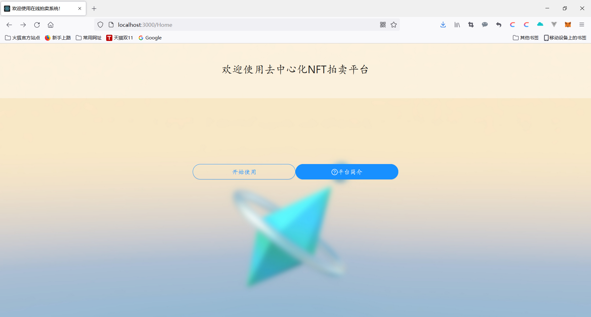

# NFT在线拍卖系统
去中心化NFT拍卖平台,是一个为用户提供NFT交易的线上平台，您可以在平台上进行有关NFT的相关操作。

- 创建您自己的NFT
- 选择您拥有的NFT进行竞价拍卖，包括设置起拍价格和拍卖时间
- 查看其他用户正在进行拍卖的产品，并进行出价
- 查看您的拍卖品的最高出价以及目前的所属权流转信息
- 拍卖结束后，确认您的卖出信息，在买方确认之后方为结束交易

为了能够正常地运行该交易系统，请确保按照以下步骤进行合约的编译以及网站的运行。在执行以下操作时，请确保./src/pages/Login/eth.js和python/contract.py中ABI的一致性；修改eth.js中的地址为合约部署后的合约地址(address)；修改config.py中的CONTRACT_ADDRESS为合约部署后的合约地址，WALLET_ADDRESS和WALLET_PRIVATEKEY为某一本地账户的信息。

1. 安装依赖

   分别在contract和frontend文件夹下执行`npm install i`命令，安装所需依赖

2. 合约的编译部署
   在控制台执行以下命令：

```c
cd contract
truffle migrate --network development
```
3. 在本地3000端口运行网站
   在控制台执行以下命令：

```c
cd frontend
npm start
```
4. 同步时间到本地链
   在控制台执行以下命令：

```c
cd python 
python eb.py
```
操作成功后，可以看到如下的成功登陆界面：
